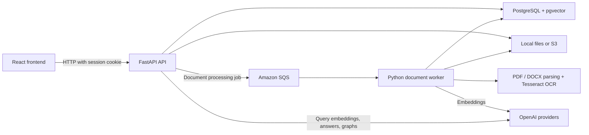

# Intellect repository architecture

This document describes the implementation as inspected on 2026-10-10. It is a
map for future work, not a production deployment specification. Entry points and
relative source links below make it possible to verify and update the description.

## Runtime overview

Intellect has three application processes: a React frontend, a FastAPI API, and a
Python document worker. PostgreSQL stores application records and pgvector
embeddings. Original documents use local filesystem storage or Amazon S3. Amazon
SQS connects persisted uploads to the worker. OpenAI providers supply embeddings,
grounded answers, and knowledge graph extraction; conversation insights are
computed locally.



| Process or resource | Entry point / configuration | Responsibility |
| --- | --- | --- |
| Browser application | [`frontend/src/main.tsx`](../frontend/src/main.tsx) | Login, projects, documents, chat, evidence, graphs, insights |
| HTTP API | [`main.py`](../src/personal_document_intelligence_api/main.py), [`api/router.py`](../src/personal_document_intelligence_api/api/router.py) | CORS, routes, authentication, authorization, orchestration |
| Document worker | [`workers/runner.py`](../src/personal_document_intelligence_api/workers/runner.py) | SQS polling, document processing, message acknowledgment |
| Database | [`compose.yaml`](../compose.yaml), `database/`, `migrations/` | Relational records, vectors, schema history |
| Development launcher | [`scripts/dev.sh`](../scripts/dev.sh) | Start database, apply migrations, launch API/worker/frontend |
| Backend container | [`Dockerfile`](../Dockerfile) | API by default; same image can run the worker command |

## Repository and module boundaries

The backend package root is `src/personal_document_intelligence_api/`.

| Path under the backend package | Responsibility |
| --- | --- |
| `api/routes/` | HTTP endpoints and conversion of domain errors into HTTP responses |
| `api/schemas/` | Pydantic request and response contracts |
| `api/dependencies/` | FastAPI dependency wiring, identity, providers, rate limits |
| `core/` | Cached environment settings and in-memory rate limiting |
| `security/` | Password hashing and verification |
| `database/models/` | SQLAlchemy table mappings |
| `database/repositories/` | Database operations and membership-filtered queries |
| `database/session.py` | Async engine, session factory, request sessions |
| `documents/` | Upload validation, parsing, OCR, storage/record lifecycle |
| `storage/` | `FileStorage` interface, local and S3 implementations, factory |
| `jobs/` | `JobQueue` contract, SQS implementation, factory |
| `workers/` | Queue consumer and extraction/chunking/embedding orchestration |
| `retrieval/` | Text chunking, embedding providers, semantic search |
| `rag/` | Evidence threshold filtering and answer generation providers |
| `knowledge/` | Graph extraction contracts, validation, document graph service |
| `insights/` | Deterministic conversation takeaways and actions |
| `evaluation/` | Retrieval runner and retrieval/generation evaluation helpers |

Outside the package, `tests/` holds backend tests, `evals/` holds retrieval cases,
and `migrations/versions/` holds Alembic revisions, including development seeds.
Dependencies and tooling are defined by `pyproject.toml`, `uv.lock`,
`frontend/package.json`, and `frontend/package-lock.json`.

## Authentication and project access

[`api/routes/auth.py`](../src/personal_document_intelligence_api/api/routes/auth.py)
verifies login credentials against persisted users and sets a signed, HTTP-only
cookie. The signed identity is the user UUID; backend membership queries use the
string `user:<uuid>`. The historical `anonymous_session_*` setting names still
configure this authenticated cookie. The frontend fetch client sends
`credentials: 'include'`, and the API enables credentialed CORS for configured
origins. Production cookies use the secure flag; a configured session secret is
required outside development.

Project members have `owner`, `editor`, or `viewer` roles. Project deletion and
membership administration require an owner. Rename, document upload/deletion,
and graph/insight generation have editor-or-owner checks in their routes. Read
operations use membership checks or repository filtering. Semantic search joins
chunks to project membership before returning results; frontend selection alone
cannot establish access. See `api/routes/projects.py`, `api/routes/documents.py`,
and `database/repositories/document_chunk.py` for the exact checks.

## Document ingestion and lifecycle

The main persisted ingestion path is `POST /documents?project_id=<uuid>` in
[`api/routes/documents.py`](../src/personal_document_intelligence_api/api/routes/documents.py).

1. The API authenticates the user, checks project write access and the applicable
   rate limit, reads the bounded upload, and validates its type and contents.
2. `DocumentUploadService` saves the original bytes and commits a document record
   with status `uploaded`. If record creation fails, it rolls back and attempts
   to remove the saved file.
3. The route publishes an SQS message containing the document UUID. Publication
   happens after the record commit. The response does not wait for extraction.
4. The worker receives the message, opens an async database session, and invokes
   `DocumentProcessor`. It marks the document `processing`, reads the original,
   parses PDF or DOCX content, and applies OCR where extraction requires it.
5. The processor replaces extracted sections, chunks the text, requests
   embeddings, replaces chunks/vectors, and commits status `ready` with page
   metadata. Blocking storage, extraction, and provider calls run in threads.
6. On processing failure, the processor rolls back derived changes, commits
   status `failed` and the error, and raises `DocumentProcessingError`. The worker
   leaves that queue message unacknowledged for retry through SQS visibility.

Ready documents skip repeat processing. Jobs for already deleted documents are
acknowledged; deletion during failed processing is also treated as a canceled
job. Invalid messages are logged and acknowledged. Successful processing is
acknowledged by deleting the SQS message.

`DocumentDeletionService` flushes the relational delete, deletes the original
file, and commits; database changes roll back on failure. Foreign keys cascade
document-derived records. This coordinates cleanup but is not a distributed
transaction across the database and file storage.

There is also a separate synchronous `POST /documents/extract` endpoint that
returns parsed sections without persistence or SQS. Its current route does not
declare an authentication dependency; do not assume every document endpoint uses
the persisted upload access path.

## Retrieval, answers, graphs, and insights

**Retrieval and answers.** `SemanticSearchService` embeds the query, then
`DocumentChunkRepository.semantic_search` ranks authorized chunks using cosine
distance and returns a score of `1 - distance`. Results can be restricted to one
document. `RagService` filters by `rag_minimum_score`; when nothing qualifies it
returns a deterministic answer with no sources and skips answer generation.
Otherwise an `AnswerGenerator` receives the question and qualifying evidence.

`POST /questions` returns the answer, source chunk IDs, document IDs, text, page
numbers, scores, and prompt author. It persists the question and answer in
`conversation_turns` under the project/thread and user. The generation call in
the current RAG service takes the current question and retrieved sources, rather
than the full previous conversation. The frontend animates the completed JSON
answer progressively; the API response is not a token stream.

**Document graphs.** `KnowledgeGraphService` reads authorized processed chunks,
calls the graph extractor, validates the output through the extraction path, and
persists the document graph, concepts, and relations. Read and generation routes
live at `/documents/{document_id}/knowledge-graph`.

**Conversation graphs.** `POST /knowledge/conversation-graph` checks project
write access and generates a graph from supplied question/answer turns. It
assigns synthetic source UUIDs to those turns and returns the result without
writing a document graph. These UUIDs are not persisted document chunk IDs.
The frontend caches conversation graphs in browser storage.

**Insights.** `insights/service.py` derives takeaways and prioritized actions
from supplied conversation turns without an external model request.
`/insights/conversation` persists generated insights; the project/thread GET
route returns the latest saved record.

## Persistence model

| Tables | Purpose and relationships |
| --- | --- |
| `users` | Email, display name, password hash; referenced by conversation authors |
| `projects`, `project_members` | Collaboration scope and unique project/member membership with roles |
| `documents` | Project, uploader identity, original storage key, file metadata, status/error |
| `document_sections` | Extracted text and extraction metadata belonging to a document |
| `document_chunks` | Ordered text chunks, project/document scope, page metadata, embedding |
| `knowledge_graphs`, `knowledge_concepts`, `knowledge_relations` | Persisted document graphs and their nodes/edges |
| `conversation_turns` | Project/thread question-answer records with user authorship |
| `project_insights` | Saved takeaways and actions associated with a project/thread |

The chunk embedding column is fixed at `Vector(1536)` in the SQLAlchemy model.
The provider's configured dimensions must match the schema and stored vectors.
Changing the model or dimensions may require migration and document reprocessing.

Original binaries are outside PostgreSQL. With local storage, API and worker
must see the same configured filesystem location. With S3, they must use the same
bucket and compatible credentials. Queue payloads identify documents; they do
not carry the original file bytes.

## Frontend organization

`main.tsx` mounts `App.tsx`, which checks authentication and shows the login or
`CollaborativeApp.tsx`. The collaborative application composes project selection,
document management, chat, graphs, and insights.

| Frontend source | Responsibility |
| --- | --- |
| `api/config.ts`, `api/client.ts`, `api/types.ts` | API base URL, HTTP requests/error handling, shared frontend contracts |
| `authStore.ts`, `projectStore.ts`, `documentStore.ts` | Session, active project, document state and refresh operations |
| `AssistantRuntimeProvider.tsx` | assistant-ui model adapter, project-scoped thread storage, response animation |
| `DocumentAttachmentAdapter.ts` | Document attachment integration |
| `AnswerEvidence.tsx`, `MarkdownAnswer.tsx` | Source evidence and rendered answers |
| `ChatGraph.tsx`, `chatGraphStore.ts` | React Flow graph display and browser graph cache |
| `promptAuthorStore.ts`, `chatContext.ts` | Prompt authorship cache and active thread context |
| `conversationParticipantStore.ts`, `components/UserAvatar.tsx` | Account/project/thread-scoped participant state and initial avatars |
| `*.css` | Component/workspace styling and theme layers |

Thread lists and history use the assistant-ui remote thread adapter backed by the
conversation API. Conversation metadata includes distinct participants derived
from the thread creator and persisted turn authors. The repository batches this
lookup across the listed threads, filters both sources by project, and places
the creator first. Routes check project membership before returning participants;
the summary exposes user IDs and display names. No additional database columns
are needed.

The frontend keeps participant summaries in memory, scoped by account, project,
and thread. Successful questions update those summaries immediately; metadata and
history reads restore them after reload. Avatars use the first letter of each
display name. Active project selection, graph cache, and prompt author cache use
browser storage. The backend separately persists conversation turns and insights.
There is no push-based cross-browser synchronization; other sessions see changes
when the relevant API data is fetched again.

## Configuration and local operation

[`core/config.py`](../src/personal_document_intelligence_api/core/config.py) loads
backend settings from environment variables and the root `.env`, with a cached
settings instance. Consult `.env.example` for the setup template.

| Settings | Use |
| --- | --- |
| `DATABASE_URL` | Required async PostgreSQL connection |
| `STORAGE_BACKEND`, `LOCAL_STORAGE_PATH`, `S3_BUCKET_NAME` | Original document storage selection/location |
| `AWS_REGION`, `SQS_QUEUE_URL` | AWS region and required processing queue |
| `OPENAI_API_KEY`, embedding/generation/knowledge graph settings | Provider credentials, models, dimensions, output limits |
| `RAG_MINIMUM_SCORE` | Evidence relevance threshold |
| `APP_ENV`, `ANONYMOUS_SESSION_SECRET`, cookie settings | Session signing and cookie behavior |
| `EXPENSIVE_RATE_LIMIT_*`, `CORS_ORIGINS` | Request limits and allowed browser origins |
| `VITE_API_BASE_URL` | Frontend build/dev API base URL; default `http://localhost:8000` |

AWS credentials use the boto3 credential chain. `scripts/dev.sh` exports
`AWS_PROFILE`, defaulting to `document-intelligence`. After installing Python and
frontend dependencies and configuring credentials, run `bash scripts/dev.sh` in
Bash (Git Bash on Windows, or a configured WSL environment). The script waits for
the database, applies migrations, then launches the API, worker, and Vite.
Ctrl+C cleans up application processes while leaving the Docker database running.
Open `http://localhost:5173` manually; the launcher has no browser-open command.

Compose defines only PostgreSQL, with persistent Docker volume storage. SQS, S3,
and OpenAI are external integrations; Compose supplies no local queue emulator.
The Dockerfile includes OCR dependencies and defaults to the API command. Running
the worker requires overriding that command. A full production deployment is not
included.

## Checks and current constraints

Backend tests cover parsing/OCR services, document processing/lifecycle,
retrieval/RAG, graph extraction/validation, insights, storage, queues, and request
behavior such as CORS and rate limits. Run `uv run pytest` for the backend suite;
Ruff configuration lives in `pyproject.toml`. Frontend checks are `npm run lint`
and `npm run build` from `frontend/`; `package.json` has no frontend test script.

The retrieval evaluation runner uses `evals/retrieval_cases.json`, real processed
project documents, a member owner ID, and embedding calls. Generation evaluation
helpers also exist under `evaluation/`. The small dataset is a regression aid;
it does not establish production retrieval quality.

From the repository root, replace the placeholders with a project UUID and a
user UUID whose `user:<uuid>` identity belongs to that project:

```bash
uv run python -m personal_document_intelligence_api.evaluation.runner --project-id <project-uuid> --owner-id user:<user-uuid>
```

Keep these implementation constraints in mind when extending the system:

- Upload storage/record commit and SQS publication are separate steps. A queue
  publish failure leaves a stored document and returns HTTP 503; there is no
  transactional outbox in this path.
- SQS visibility and redrive configuration live outside this repository. The
  worker does not extend visibility while processing long jobs.
- Request rate limits are in memory per API process, not shared across replicas.
- Browser-local threads and caches require explicit design work for cross-browser
  synchronization and account separation on a shared browser.
- Development seed accounts and the development session secret are fixtures, not
  a production identity setup.

Update this document when changing service boundaries, route contracts,
authorization, storage, schema, processing behavior, or deployment assumptions.
